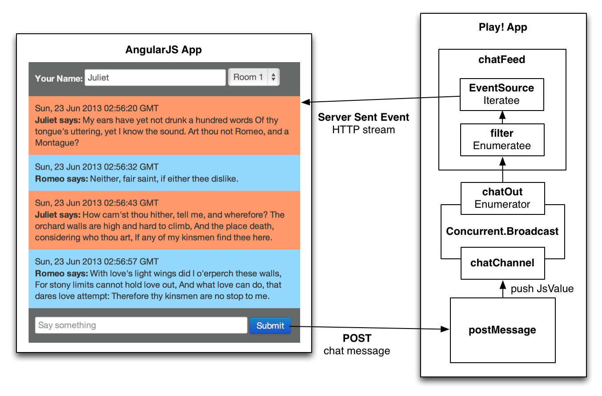

sse-chat-example
================

This is a simple chat application using **[Play Framework](http://www.playframework.com)** together with **[AngularJS](http://angularjs.org)**. It makes use of a Concurrent.Broadcast object as an Enumerator, a filtering Enumeratee and EventSource as the **[Iteratee](http://www.playframework.com/documentation/2.1.0/Iteratees)**. Together these building blocks facilitate the chat message data flow within the application, with no more than 5 lines of code in Scala for the entire application. 

The application uses Server Sent Events for delivering messages to the client and REST calls for sending messages to the server. The messages flow from the POST to the **[Server Sent Events (SSE)](http://dev.w3.org/html5/eventsource/)** stream through Concurrent.Broadcast as the central information hub into the chatFeed controller which attaches an Enumeratee / Iteratee chain  to the Enumerator provided by Concurrent.Broadcast.

The client is designed as a single page application using **[AngularJS](http://angularjs.org)**. The file organization is inspired by the **[angular-seed](https://github.com/angular/angular-seed)** project.