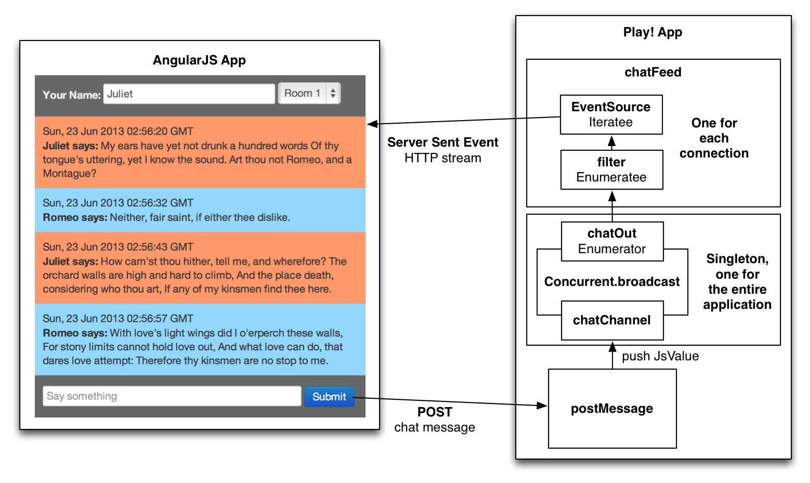
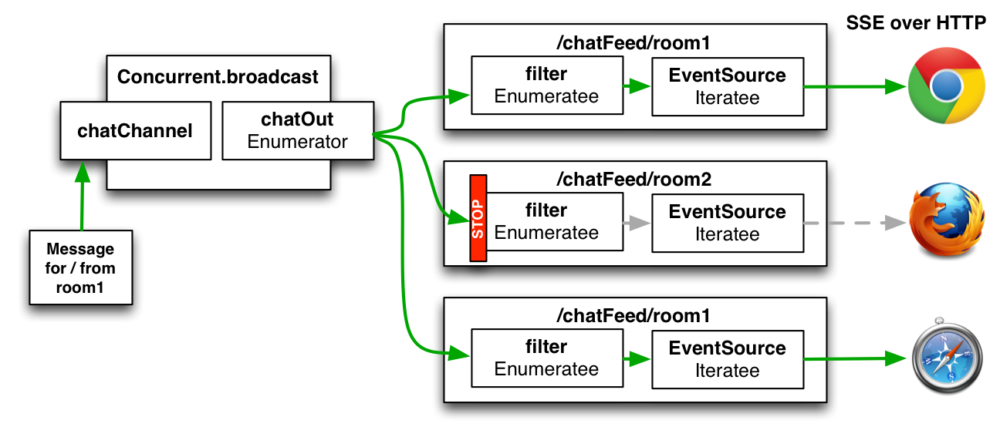

sse-chat
========

This is a simple chat application using **[Play Framework](http://www.playframework.com)** together with **[AngularJS](http://angularjs.org)**. It makes use of a Concurrent.Broadcast object as an Enumerator, a filtering Enumeratee and EventSource as the **[Iteratee](http://www.playframework.com/documentation/2.1.0/Iteratees)**. Together these building blocks facilitate the chat message data flow within the application. 



The application uses Server Sent Events for delivering messages to the client and REST calls for sending messages to the server. The messages flow from the POST to the **[Server Sent Events (SSE)](http://dev.w3.org/html5/eventsource/)** stream through Concurrent.broadcast as the central information hub into the chatFeed controller which attaches an Enumeratee / Iteratee chain to the Enumerator provided by Concurrent.broadcast. Filtering for the correct chat room is done with a filtering Enumeratee. 



The client is designed as a single page application using **[AngularJS](http://angularjs.org)**. The file organization is inspired by the **[angular-seed](https://github.com/angular/angular-seed)** project.

Alternatively, there is another client based on Facebook's React instead of AngularJS. This alternative version can be accessed under ```localhost:9000/react```. Blog post about the React version will follow.

There are Romeo and Juliet hanging out in Room 1 in order to make looking at the app a little less boring. They are having their balcony scene conversation, but they are confused, uttering the lines at random.

How to run this: 

1) with Play installed on your machine: **play run** in the project folder
    
2) without Play installed you can make use of the Typesafe Activator feature: **./activator ui** in the project folder (or double click on activator script in OS X)

This application will work in Firefox, Safari, Chrome and Opera. It will not work in Internet Explorer, simply because Microsoft for whatever reason does not support Server Sent Events.  

More information on **[matthiasnehlsen.com](http://matthiasnehlsen.com/blog/2013/06/23/angularjs-and-play-framework/)**.

**Edit January 2014**: there is also a client version running Scala.js, please check the **[README](./scala-js/README.md)** in the scala-js folder for more information how to build this. The Closure Compiler optimized JavaScript of the application is included in this project, whereas the other resulting files from the build process are excluded for reasons of space.

## Licence

This software is licensed under the Apache 2 license, quoted below.

Copyright &copy; 2013 **[Matthias Nehlsen](http://www.matthiasnehlsen.com)**.

Licensed under the Apache License, Version 2.0 (the "License"); you may not use this project except in compliance with the License. You may obtain a copy of the License at http://www.apache.org/licenses/LICENSE-2.0.

Unless required by applicable law or agreed to in writing, software distributed under the License is distributed on an "AS IS" BASIS, WITHOUT WARRANTIES OR CONDITIONS OF ANY KIND, either express or implied. See the License for the specific language governing permissions and limitations under the License.
